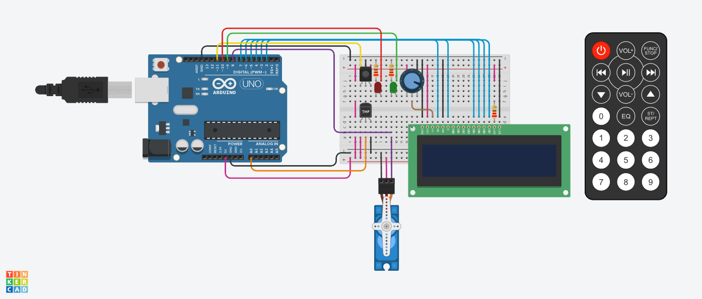
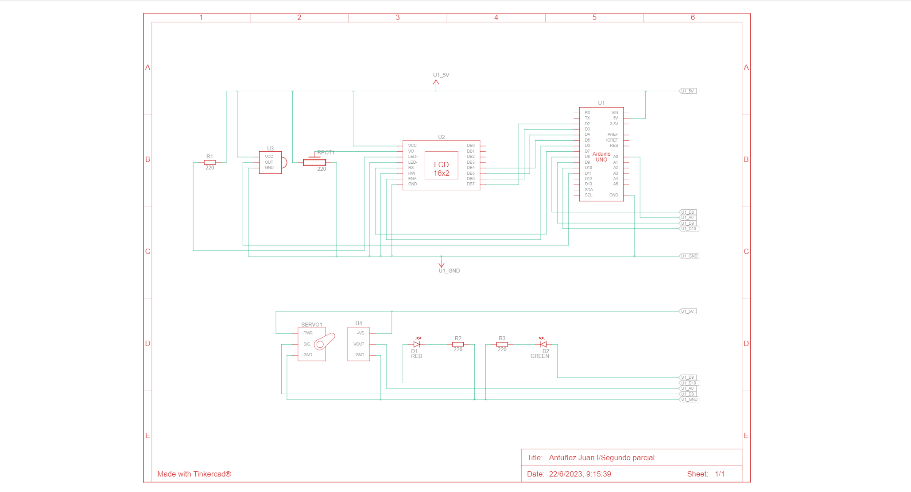

# Segundo parcial
## Nombre:
---
* Antuñez, Juan Ignacio.
## Proyecto: Sistema de incendios
---

## Descripción
---
El proyecto consiste en la elaboración de un sistema de incendios que detecta y muestra por pantalla la temperatura ambiente, se muestra en pantalla junto con la estación del año y en caso de haber un incendio se activa la alarma.
## Diagrama esquemático
---

## Función principal
---
~~~c++
int temActual = 0;
bool encendido = false;
bool incendio = false;
int ms = 15;

void loop()
{
    if (IrReceiver.decode())
    {
        if (IrReceiver.decodedIRData.decodedRawData == onOff)
        {
            lcd.clear();
            temActual = 0;
            encendido = !encendido;
        }
        IrReceiver.resume();
    }

    if (encendido)
    {
        int lecturaSensor = analogRead(SENSOR);
        int temperatura = map(lecturaSensor, 20, 358, -40, 125);

        digitalWrite(LED_ROJO, LOW);
        digitalWrite(LED_VERDE, HIGH);

        estaciones(temperatura, temActual);

        if (temperatura >= 50)
        {
            incendio = true;
            digitalWrite(LED_VERDE, HIGH);
            digitalWrite(LED_ROJO, HIGH);
            alarma(incendio, ms);
        }
    }
    else
    {
        digitalWrite(LED_ROJO, HIGH);
        digitalWrite(LED_VERDE, LOW);
    }
}
~~~
Se inicializan cuatro variables que marcaran la temperatura actual, si el sistema está encendido, si hay un incendio y la velocidad del servo. La función principal primero comprueba que se encienda el sistema a través del control, una vez encendido detecta la temperatura y llama a **estaciones** para determinar la estación del año.
~~~c++
void estaciones(int temperatura, int &temActual)
{
    if (temperatura != temActual)
    {
        lcd.clear();
        if (temperatura >= -40 && temperatura <= 5)
        {
            mostrarEstacion("Winter", temperatura, temActual);
        }
        else if (temperatura > 5 && temperatura <= 15)
        {
            mostrarEstacion("Autumn", temperatura, temActual);
        }
        else if (temperatura > 15 && temperatura <= 25)
        {
            mostrarEstacion("Spring", temperatura, temActual);
        }
        else if (temperatura > 25 && temperatura < 50)
        {
            mostrarEstacion("Summer", temperatura, temActual);
        }
    }
}
~~~
Una vez determinada la estación del año esta se muestra en el display llamando a **mostrarEstacion**.
~~~c++
void mostrarEstacion(String estacion, int temperatura, int &temActual)
{
    lcd.setCursor(0, 0);
    lcd.print(estacion);
    lcd.setCursor(0, 1);
    lcd.print(temperatura);
    lcd.print("C");
    temActual = temperatura;
}
~~~
En caso de que la temperatura sea muy elevada se detectara que hay un incendio y se llamará a **alarma** que mostrará una advertencia en pantalla y empezará a mover el servo, este pudiendo ser controlada su velocidad, hasta que el usuario la desactiva.
~~~c++
void alarma(bool &incendio, int &ms)
{
    lcd.setCursor(0, 0);
    lcd.print("Incendio");
    int i = 0;
    bool flag = true;

    while (incendio)
    {
        if (IrReceiver.decode())
        {
            if (IrReceiver.decodedIRData.decodedRawData == stop)
            {
                incendio = false;
            }
            if (IrReceiver.decodedIRData.decodedRawData == more && ms >= 5)
            {
                ms--;
            }
            if (IrReceiver.decodedIRData.decodedRawData == less && ms <= 30)
            {
                ms++;
            }
            IrReceiver.resume();
        }
        
        servoMotor.write(i);
        delay(ms);

        if (flag)
            i++;
        else
            i--;

        if (i > 180)
            flag = false;
        else if (i < 0)
            flag = true;
    }
}
~~~
## Link al proyecto
* [Proyecto](https://www.tinkercad.com/things/e9qv1TXTi2M)
---